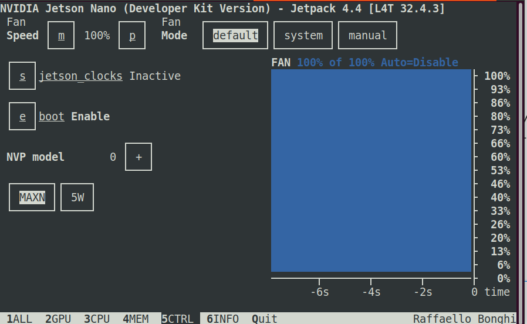

## 20200902T22:00 Tensorflow

目标：
1. 给jetson nano安装依赖包，用于控制jetbot小车
2. 在nano上安装Tensorflow

Next Steps: 
1. 让Jetbot小车动起来

### 1. Jetbot相关组件

#### 1.1 swapfile

要给Jetson划更大一些的swap空间。在linux系统中，swap是干吗用的，建议google一下

```shell
$ sudo fallocate -l 4G /var/swapfile
$ sudo chmod 600 /var/swapfile
$ sudo mkswap /var/swapfile
$ sudo swapon /var/swapfile
$ sudo bash -c 'echo "/var/swapfile swap swap defaults 0 0" >> /etc/fstab'
```

#### 1.2 安装包

Jetbot正常运行时，需要一系列安装包
- Adafruit-GPIO
- Adafruit-MotorHAT
- Adafruit-PureIO
- Adafruit-SSD1306
- Flask
- Jetson.GPIO
- numpy
- pyserial
- pillow

安装时使用下面的命令，其中`xxxx`为安装包的名称
```shell
$ sudo pip3 install xxxx
```

记得使用tsinghua源，不然这些包下载耗时会很长

Archiconda里把`traitlets`装上
```shell
$ conda install traitlets
```

#### 1.3 Jetbot

Nvidia为jetbot建立了专门的GitHub页面，网址在<a href="https://github.com/NVIDIA-AI-IOT/jetbot">https://github.com/NVIDIA-AI-IOT/jetbot</a>，我们要做的是下载并安装这个东东

```shell
$ cd ~/Soft # 可选，或者换成你想要的其他目录
$ git clone https://github.com/NVIDIA-AI-IOT/jetbot
$ cd jetbot
$ sudo python3 setup.py install
```

### 2. TensorFlow
Nvidia提供了Jetson上安装TensorFlow的方法，见<a href="https://docs.nvidia.com/deeplearning/frameworks/install-tf-jetson-platform/index.html">https://docs.nvidia.com/deeplearning/frameworks/install-tf-jetson-platform/index.html</a>

#### 2.1 确认JetPack运行状态
```shell
$ sudo jtop # 初次安装，使用sudo apt install jtop
```
在jtop里，调整到5CTRL页面，可以看到jetson nano是以5W的低功率模式，还是MAXN的全功率模式运行。如果是5W低功率，建议改为MAXN，因为随后安装一系列程序会很吃CPU算力



```shell
$ sudo nvpmodel -m0 # 切换至MAXN高功率模式
$ sudo nvpmodel =m1 # 切换至5W低功率模式
```

也可以用`-q`参数随时查看当前功率

```shell
$ sudo nvpmodel -q
NV Power Mode: MAXN
0
```


#### 2.2 预装TF的依赖包，时间很长，做好准备
```shell
$ sudo apt-get install libhdf5-serial-dev hdf5-tools libhdf5-dev zlib1g-dev zip libjpeg8-dev liblapack-dev libblas-dev gfortran
$ sudo pip3 install -U testresources setuptools
$ sudo pip3 install -U numpy==1.16.1 future==0.17.1 mock==3.0.5 h5py==2.9.0 keras_preprocessing==1.0.5 keras_applications==1.0.8 gast==0.2.2 futures protobuf pybind11
```

#### 2.3 安装TensorFlow
在安装TensorFlow的时候，总是出现error，大意是grpcio安装失败。查了一下问题可能在于以下网址

https://groups.google.com/g/grpc-io/c/VdoTPMT5WwU/m/fMmXxFiBAwAJ?pli=1 

https://forums.developer.nvidia.com/t/unable-to-install-tensorflow-in-jetson-nano/81289/6

按你胃，按照它所说的那样，一个较旧的版本就行了**(这一步浪费了我4个小时的时间！！！）**

```shell
$ sudo pip3 install setuptools==46.0.0
$ sudo pip3 install grpcio==1.26.0
```

然后正式安装TF，根据的是Nvidia官网上的Jetson平台安装TF介绍，https://docs.nvidia.com/deeplearning/frameworks/install-tf-jetson-platform/index.html

```shell
$ sudo pip3 install --pre --extra-index-url https://developer.download.nvidia.com/compute/redist/jp/v44 tensorflow
```
说明：
- 时间更长，做好准备
- v44是JetPack当前版本号，如上图所示，记得一一对应。
- 今年起TF统一将`tensorflow-gpu`包改名为`tensorflow`，翻老文档的时候要留心

#### 2.4 测试一下
```shell
$ python3.6
Python 3.6.9 (default, Jul 17 2020, 12:50:27) 
[GCC 8.4.0] on linux
Type "help", "copyright", "credits" or "license" for more information.
>>> import tensorflow
2020-09-02 19:29:44.753227: I tensorflow/stream_executor/platform/default/dso_loader.cc:48] Successfully opened dynamic library libcudart.so.10.2
```
