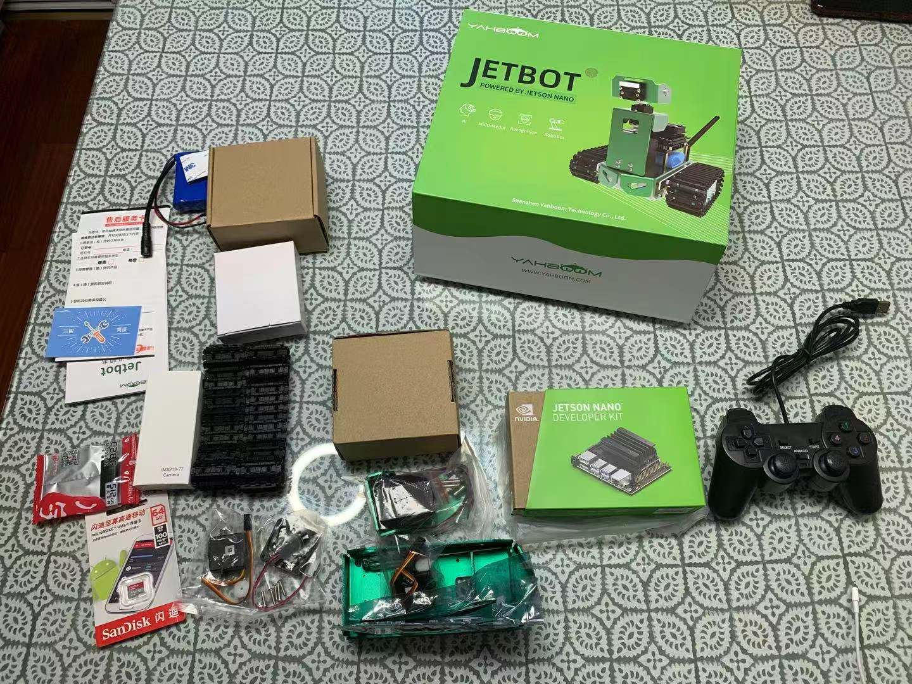
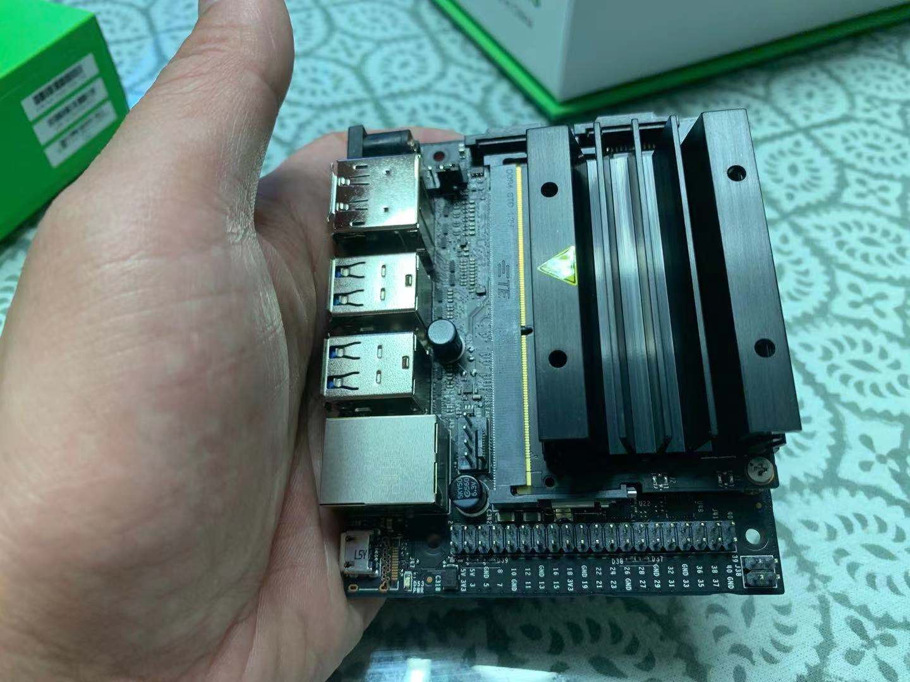
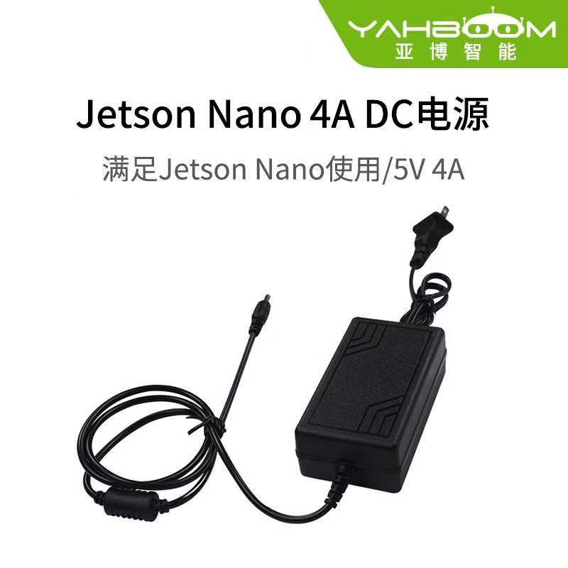
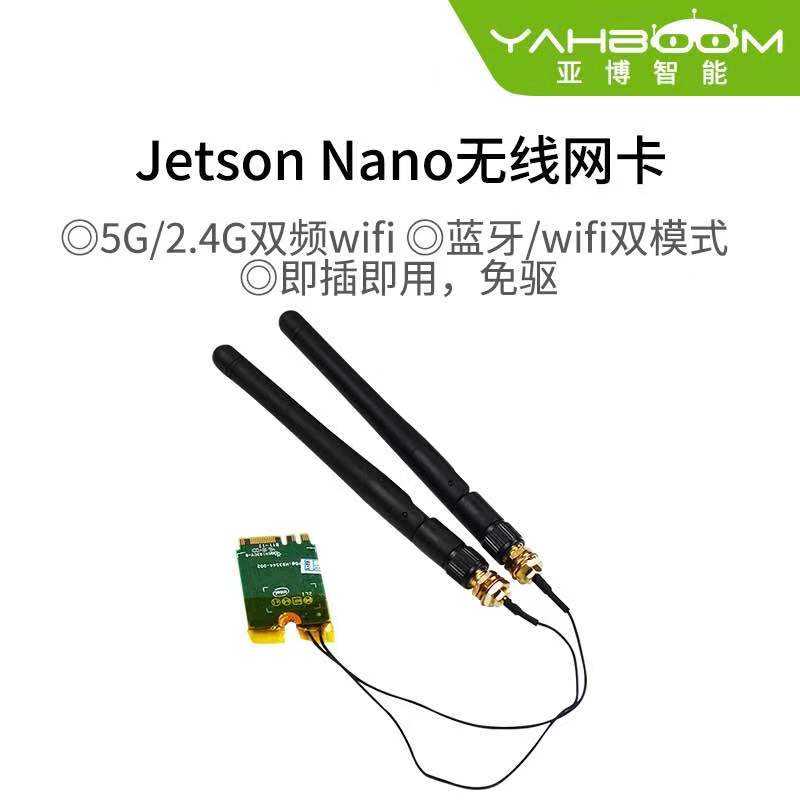
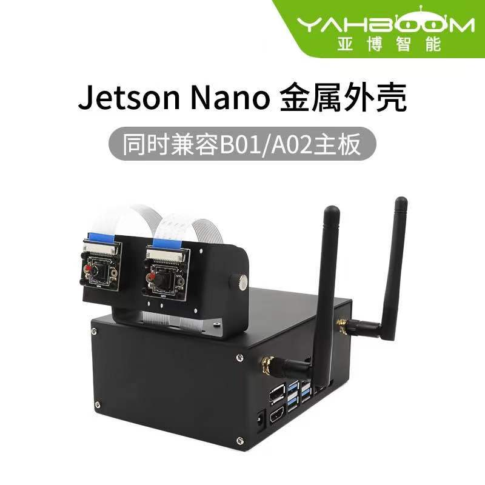
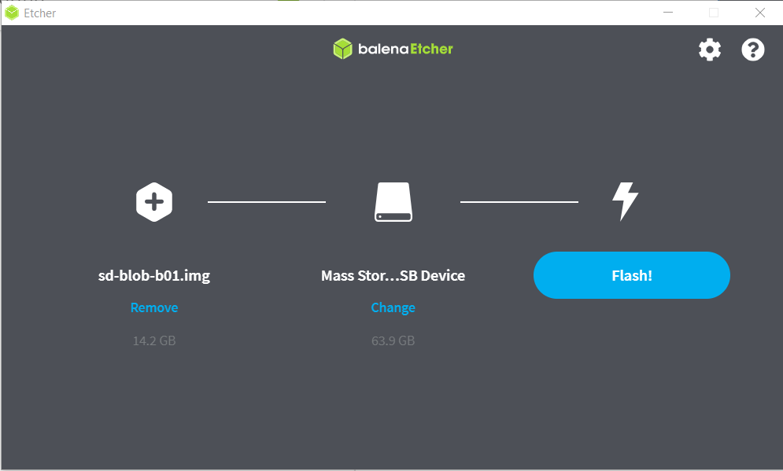
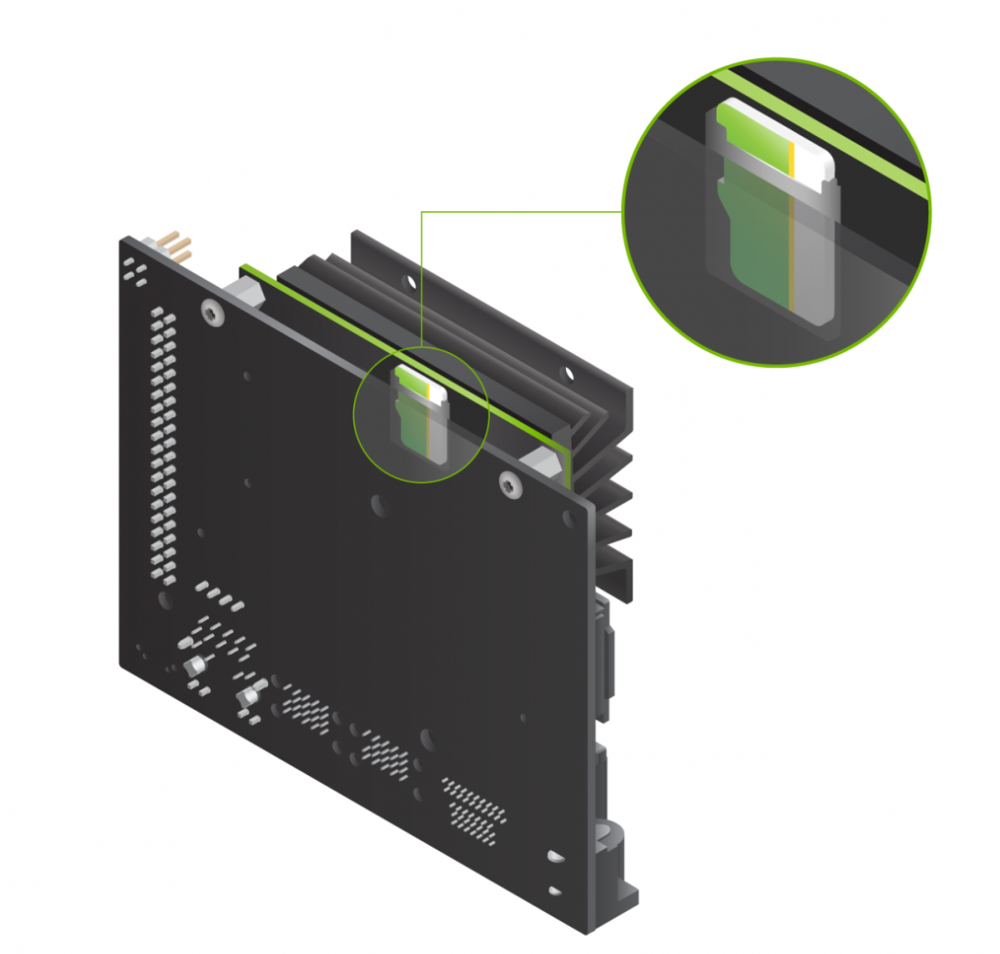
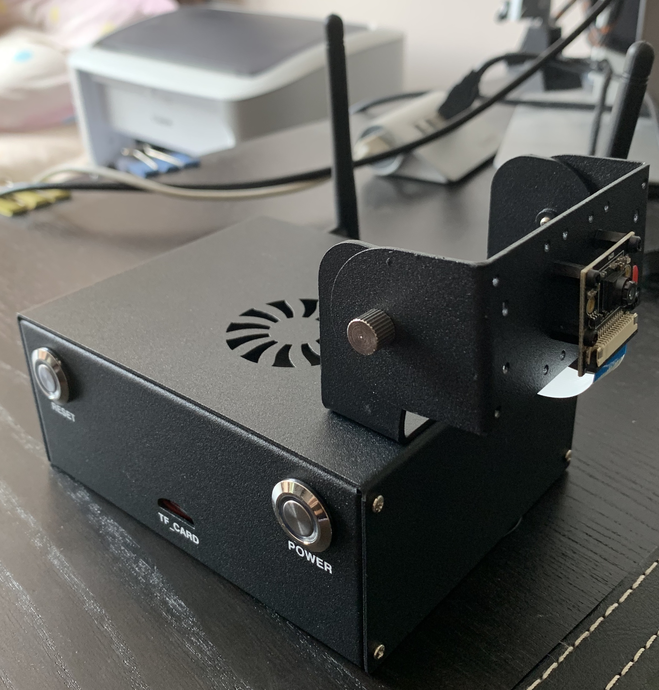
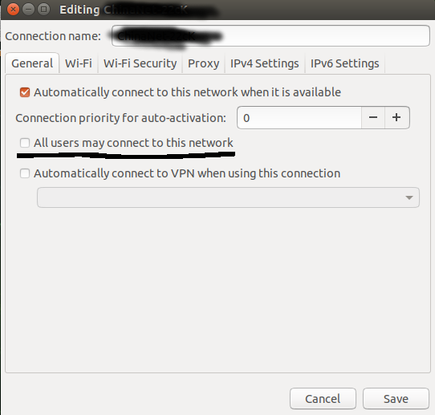
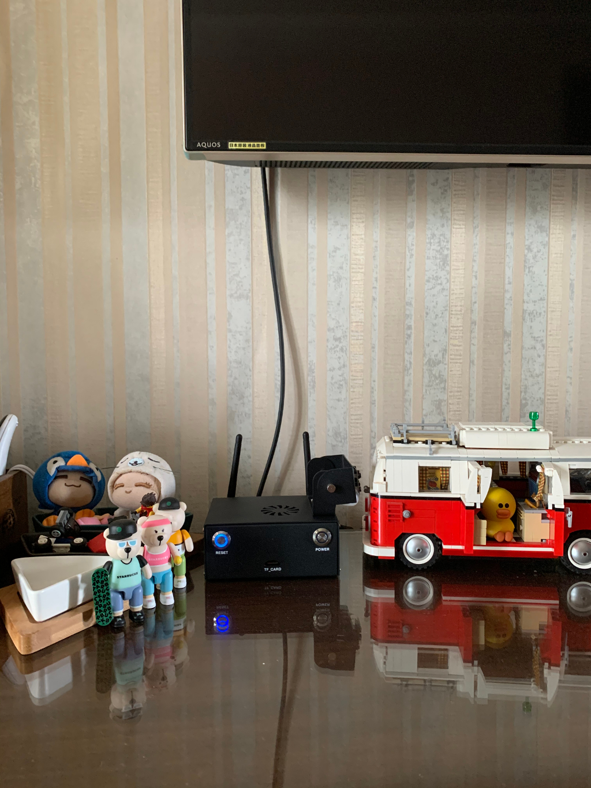

# Jetson Nano日记
## 20200823T23:00

买了个Jetson Nano的AI小板子，打算玩一玩智能图像识别，免得18年学的那些deeplearning的东东都忘了。为了让Jetson Nano能够动起来，又买了个Jetbot智能小车。

在天猫上搜了一圈，最后选定了亚博智能(YAHBOOM)的这款，三自由度带升降（含主板），[链接在这里](https://detail.tmall.com/item.htm?spm=a1z10.5-b-s.w5001-22651484579.3.10c86a8316it8K&id=607946624469&rn=d7e5113d984e570bca30e0948552d9d9&abbucket=10&scene=taobao_shop)

主要考虑如下
- 我不懂硬件，不算最狂热的build-from-scratch，只能买来半成品的各种零配件回来组装。（各种论坛里给了很多3D打印的文件，可以下载下来找个3D打印店给打印出来；但各种电机、轴承之类的就不是我熟悉的了，也不是这第一轮工作的重点。等这个小车跑起来了之后，可以考虑第二轮再从头开始玩个硬件）
- 有几种类型的平台可供选择，如树莓派系列的海量小车等。选了jetbot是因为
    - 看起来它的实时计算性能还算强大，比树莓派强
    - 上次树莓派玩hi了之后，不小心在ARM架构上编译安装X86的代码，然后就没有然后了...
    - 总想玩点新鲜的

商家发货很快，经过3天的等待，今天包裹送到了，如下

Jetson Nano的板子比我想象的要小一些——Hi Nano，初次见面，请多关照

开工。基本思路是按照如下顺序来搞（当然是个high level的设想）：
1. 先把Jetson Nano平台搞起来，搞到八九不离十之后
2. 组装Jetbot硬件，把小车跑起来
3. 看看Jetson Nano还能玩些别的什么

今天进度及发现的问题

1. 下载速度太慢！亚博智能给的是个百度网盘的下载链接，麻烦多多。一是百度网盘只支持windows，二是百度网盘限速限得厉害，非会员只给大概100k/s，这些加起来近百G的文件要下载到几十个小时。我现在只能百无聊赖的蹲在windows系统里边下载边等。————我跟客服留言了，建议给个bt种子啥的，这样会方便很多。
2. 零配件缺乏。拿到板子我才发现缺了几样很重要的东西：
    - Micro-USB数据线。Jetson Nano有两种充电方式，1是利用Micro-USB线充电，2是DC直筒型供电插口。这两样东西我都没有。解决方案：京东上下单1条绿联的Micro-USB线15块（邮费8块），明天上午就可以送到；回亚博智能淘宝店里下单一个Jetson Nano 5V4A的DC电源，22.5块

    - 无线网卡模块。Jetson Nano默认没有无线网卡功能，只提供一个水晶头插口，在家里干活实在是不方便——要撅到路由器那边插上网线才能用，别提多麻烦了。解决方案：回亚博智能淘宝店里下单一个无线网卡模块，89块
    
    - 机箱。总这么裸露着还是很危险，随便滴上去几滴水就糟了。于是再回亚博智能淘宝店，下单1个带风扇的金属外壳，支持上述无线网卡天线的那种，79块

    
    明天上午数据线来了之后，先临时撅到路由器旁边插上有线连接使用，期待着2天之后无线网卡和机箱到货，再作进一步改装。
3. 刷ROM。NVIDIA官网提供了详细的Jetson Nano Development Kit安装设置教程，首先是[刷SD card](https://developer.nvidia.com/embedded/learn/get-started-jetson-nano-devkit#write)
    - 下载Image，很大，6.5G，耐心下吧。[地址在这里](https://developer.nvidia.com/jetson-nano-sd-card-image)
    - 刷Image建议用[Etcher](https://www.balena.io/etcher/)，linux/mac os x/win什么平台都支持，我用了它好多年了
    - 发来的快递中包括1张64G SanDisk的存储卡，1个读卡器，直接插上，用Etcher烧录吧

    - 烧录大概用了15-20分钟，然后根据Nvidia官网的介绍，把卡插到主板上去

4. 准备好了额外的1根HDMI线，1个蓝牙键盘（原本是给ipad pro准备的），1个鼠标
5. 现在没别的能做的了。只能等待明天京东的Micro-USB数据线到货，给Jetson Nano主板供电，先把系统run起来再说。

## 20200825T12:00

中午收到亚博智能淘宝店发来的第2个快递（机箱等补充硬件到货了），中午到现在做了以下几件事：

1. 组装Jetson Nano机箱
1. 配置基本系统
1. 远程访问

### 组装Jetson Nano机箱
机箱和DC电源到货，开始动手安装Jetson Nano。
需要注意的是：
- 务必详细阅读官网上的安装说明文档，需要注意的是power reset和短脚4组针与主板排针的连接，别插错了
- 安装大约20分钟，耐心点就是了，难度却不大，以前有过自己攒PC机，或者拆开笔记本换电池/内存/硬盘等部件经验的，基本上都能自己搞定————你大学的时候没有女同学找你帮忙攒过PC，或者修过笔记本？？对不起打扰了... 当我什么都没说...
- 商家送的那个螺丝刀非常不好用，墙裂建议自己准备一个趁手的。螺丝刀质量不好，把螺丝拧花了，未来再拆卸机箱的时候就会很麻烦 
- 买机箱送的那个风扇，质量很一般，看随后的温度吧。如果将来温度较高，考虑再买个给力点的换上
- 拧好螺丝，DC电源启动开机不能启动，风扇不转。使用排除法检测是否是DC电源的物理故障：换用micro USB以数据线的方式启动（前几天尝试用数据线启动，正常），风扇转，系统不启动。
    - 最终发现问题：漏掉了主板上的一个跳线。改用DC电源后，需要将jetson nano上的一个跳线帽拔出，重新插进去并**覆盖全部2个针脚**(原厂初始状态是只覆盖了1个针脚），这样调整为使用DC电源为主板提供全功率供电模式  
    

重新启动后，一切正常。机箱尺寸很小，和我的铜尺（长12cm）近似

搭配上提前准备好的显示器、蓝牙键盘和无线鼠标，开机后，一切正常

### 配置基本系统

核心目的是升级系统到最新状态。

注意1）Jetson Nano的CPU架构是aarch64，与常见的x86_64和arm64都不同2）Jetson Nano官方image是基于ubuntu的。3）需要找到一个国内的源来替换原有的国外源，提高下载速度
yanyuan@yanyuan-Jetson:~$ uname -a
Linux yanyuan-Jetson 4.9.140-tegra #1 SMP PREEMPT Thu Jun 25 21:25:44 PDT 2020 aarch64 aarch64 aarch64 GNU/Linux
找了一下，还得是tsinghua的tuna源。
$ sudo cp /etc/apt/sources.list /etc/apt/sources.list-backup-20200826
$ sudo vim /etc/apt/sources.list
覆盖原文件中的内容
deb http://mirrors.tuna.tsinghua.edu.cn/ubuntu-ports/ bionic main multiverse restricted universe
deb http://mirrors.tuna.tsinghua.edu.cn/ubuntu-ports/ bionic-security main multiverse restricted universe
deb http://mirrors.tuna.tsinghua.edu.cn/ubuntu-ports/ bionic-updates main multiverse restricted universe
deb http://mirrors.tuna.tsinghua.edu.cn/ubuntu-ports/ bionic-backports main multiverse restricted universe
deb-src http://mirrors.tuna.tsinghua.edu.cn/ubuntu-ports/ bionic main multiverse restricted universe
deb-src http://mirrors.tuna.tsinghua.edu.cn/ubuntu-ports/ bionic-security main multiverse restricted universe
deb-src http://mirrors.tuna.tsinghua.edu.cn/ubuntu-ports/ bionic-updates main multiverse restricted universe
deb-src http://mirrors.tuna.tsinghua.edu.cn/ubuntu-ports/ bionic-backports main multiverse restricted universe
跑update & upgrade吧
$ sudo apt update
$ sudo apt upgrade
搞定之后需要重新启动一下，大功告成。

### 远程访问
#### SSH

配置远程访问的目的是，可以通过其他计算机（比如我现在用的台式机）远程访问这台Jetson Nano进行操作。这样可以把Jetson Nano扔得远远地（比如我想把它放到客厅电视机旁边），也不用插鼠标键盘显示器了，我在书房PC机上远程登录玩它就可以。基本思路是用ssh。

好在已经是个很成熟的技术了，jetson-nano预装了ssh-server，可以省掉此一步骤，这里不贅数(感兴趣的google一下"ubuntu ssh server"就行，一抓一大把

在jetson nano上ifconfig，看看ip地址是多少
$ ifconfig

yanyuan@yanyuan-Jetson:~$ ifconfig
eth0: flags=4099<UP,BROADCAST,MULTICAST>  mtu 1500
        ether 00:04:4b:e7:53:b7  txqueuelen 1000  (Ethernet)
        RX packets 0  bytes 0 (0.0 B)
        RX errors 0  dropped 0  overruns 0  frame 0
        TX packets 0  bytes 0 (0.0 B)
        TX errors 0  dropped 0 overruns 0  carrier 0  collisions 0
        device interrupt 150  base 0xc000  

lo: flags=73<UP,LOOPBACK,RUNNING>  mtu 65536
        inet 127.0.0.1  netmask 255.0.0.0
        inet6 ::1  prefixlen 128  scopeid 0x10<host>
        loop  txqueuelen 1  (Local Loopback)
        RX packets 394  bytes 30262 (30.2 KB)
        RX errors 0  dropped 0  overruns 0  frame 0
        TX packets 394  bytes 30262 (30.2 KB)
        TX errors 0  dropped 0 overruns 0  carrier 0  collisions 0

rndis0: flags=4099<UP,BROADCAST,MULTICAST>  mtu 1500
        ether 6e:44:a6:50:f8:2d  txqueuelen 1000  (Ethernet)
        RX packets 0  bytes 0 (0.0 B)
        RX errors 0  dropped 0  overruns 0  frame 0
        TX packets 0  bytes 0 (0.0 B)
        TX errors 0  dropped 0 overruns 0  carrier 0  collisions 0

usb0: flags=4099<UP,BROADCAST,MULTICAST>  mtu 1500
        ether 6e:44:a6:50:f8:2f  txqueuelen 1000  (Ethernet)
        RX packets 0  bytes 0 (0.0 B)
        RX errors 0  dropped 0  overruns 0  frame 0
        TX packets 0  bytes 0 (0.0 B)
        TX errors 0  dropped 0 overruns 0  carrier 0  collisions 0

wlan0: flags=4163<UP,BROADCAST,RUNNING,MULTICAST>  mtu 1500
        inet 192.168.1.15  netmask 255.255.255.0  broadcast 192.168.1.255
        inet6 240e:e0:ae70:6200:14a0:e172:c370:d608  prefixlen 64  scopeid 0x0<global>
        inet6 fe80::b30:1600:d95:37f9  prefixlen 64  scopeid 0x20<link>
        inet6 240e:e0:ae70:6200:2de1:6e42:3d71:6ddf  prefixlen 64  scopeid 0x0<global>
        ether 50:76:af:57:06:43  txqueuelen 1000  (Ethernet)
        RX packets 873  bytes 412604 (412.6 KB)
        RX errors 0  dropped 0  overruns 0  frame 0
        TX packets 948  bytes 133844 (133.8 KB)
        TX errors 0  dropped 0 overruns 0  carrier 0  collisions 0
其他看不懂没关系，以后慢慢学都行，关键的一行是wlan0这个无线网卡的地址 *inet 192.168.1.15*，这是需要的

回到PC机上ssh连接它吧
$ ssh xxxx@192.168.1.15
其中xxxx是你在jetson nano上的用户名，如果不记得了，就回到jetson nano上`$whoami`一下

terminal中弹出一大堆内容，愿意读就读一下，不愿意读就直接输入yes。顺利登录了对吗？来个`rm -rf /`庆祝一下吧（千万不要...我开个玩笑）

#### 启动后自动连接

另一个很无聊的小窍门是，在默认状态下，每次jetson nano的ubuntu重新启动后，都必须输入用户名和密码，在登录状态下才会自动寻找无线连接。既然要远程搞它，那就得让他哪怕在无人登录的情况下，也可以自动连接到（无线）网络。分2步来。

第1步是，打开network-manager，在wifi下，找到当前使用的路由器，选择“设置”的齿轮。弹出菜单中，勾选中“All users may connect to his network"

第2步是编辑/etc/network/interfaces文件，在最下一行输入
auto wlan0
wlan0就是上面ifconfig时看到的网卡名称，如果你的系统并不叫这个，比如叫wifi0，那就相应地改成`auto wifi0`即可

重启一下，看看能不能在无用户登录的状态下，ssh连接到这台jetson nano。

如果能，那么远程设置就OK了。可以把jetson nano关机，扔到合适的角落去了——暂时先把他放在大众旅行车旁边

